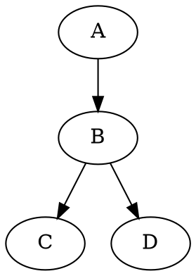

```dot
digraph G {
  A -> B
  B -> C
  B -> D
}
```
[A Little Statistical Mechanics for the Graph Theorist](https://arxiv.org/abs/0804.2468)

[The Colin de Verdiere graph parameter](https://homepages.cwi.nl/~lex/files/cdvsurvey_new2.pdf)
